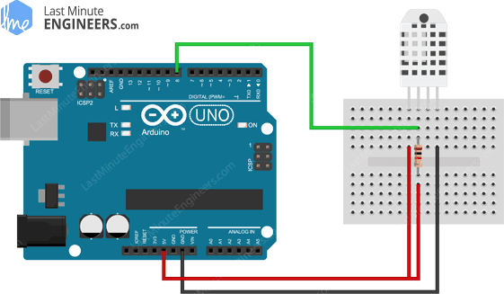

# Introduction

“Agricultural operations waste 60% of water consumed each year”. Hence, new
technologies for water conservation must be adopted. “According to U.S.
government statistics, however, only 10% of irrigated farms use advanced water
management decision tools, including precision irrigation controls and soil
moisture/water level sensing devices.” [1]

A Smart Irrigation System allows for sustainable agriculture by monitoring the
field in real- time. Using sensors and controllers, a smart irrigation system
will not only save time for farmers but will also reduce the excessive use of
resources such as water and electricity. It monitors various factors like soil
moisture, etc... to perform appropriate actions in real-time.

This Smart Irrigation System prototype is based on Arduino microcontroller.
Three sensors monitor the amount of soil moisture, the temperature/humidity,
and the water level. The deviation of any of these parameters from the
specified range will activate the irrigation system, pumping water for watering
the plants.

Benefits of this Smart Irrigation System:

- It’s easy to install and configure.
- Saves time, water, and energy.
- Reduces runoff from overwatering saturated soil.
- Eliminates labor work since water pumps are automated.

This prototype can be modified to be implemented on a large scale for farming
purposes.

# Parts List

The following list covers the major parts I used in the build. I've linked to
the actual parts I used, when applicable.

| #Item | Item Description                             | Cost    |
|-------|----------------------------------------------|---------|
|   1   | Arduino Uno                                  |  $23.99 |
|   3   | 9V Power Supply                              |  $17.52 |
|   4   | DHT22 temperature and humidity sensor        |  $16.49 |
|   5   | Capacitive Soil Moisture Sensor              |  $10.58 |
|   6   | Liquid Contact Sensor                        |  $10.99 |
|   7   | 3V-5V DC Submersible Water Pump + PVC tubing |  $16.99 |
|   8   | 4 Channel DC 5V Relay                        |  $11.86 |
|   9   | Jumper Wires                                 |   $8.99 |
|   10  | 3D Printed Water Tank                        |   $0.00 |
|   11  | 3D Printed Casing                            |   $0.00 |
| TOTAL |                                              | $117.41 |

# Wiring Diagram

## Water Level Sensor

## Temperature and Humidity Sensor

# Reference

[1] https://www.smartfarm.ag/about-us/the-problem-to-be-solved/
[2] https://lastminuteengineers.com/water-level-sensor-arduino-tutorial/
[3] https://lastminuteengineers.com/dht11-dht22-arduino-tutorial/
[4] https://github.com/RobTillaart/Arduino/tree/master/libraries/DHTlib
